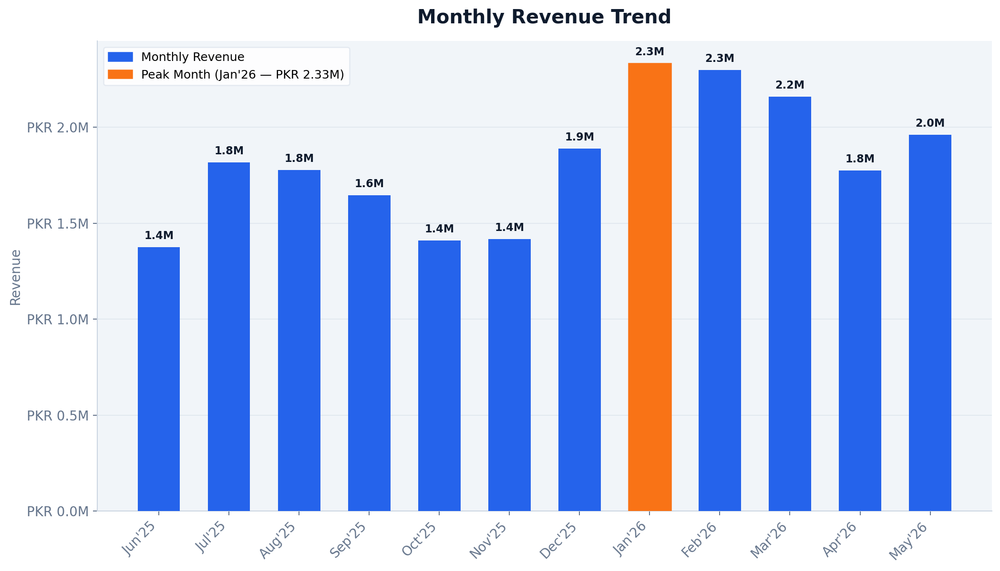
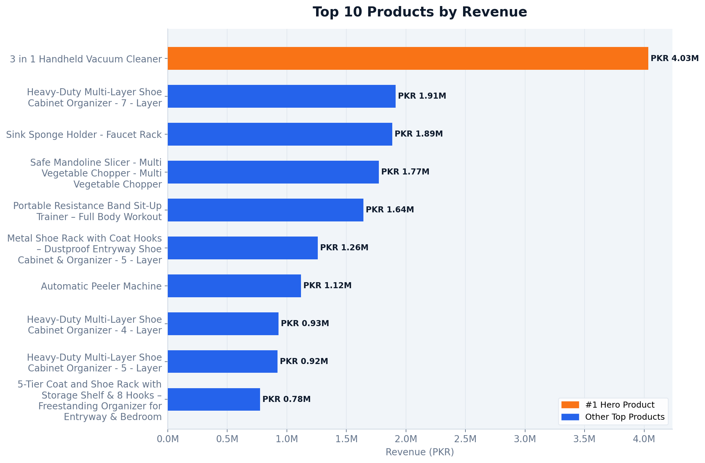
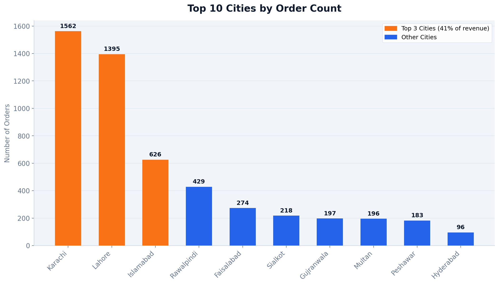
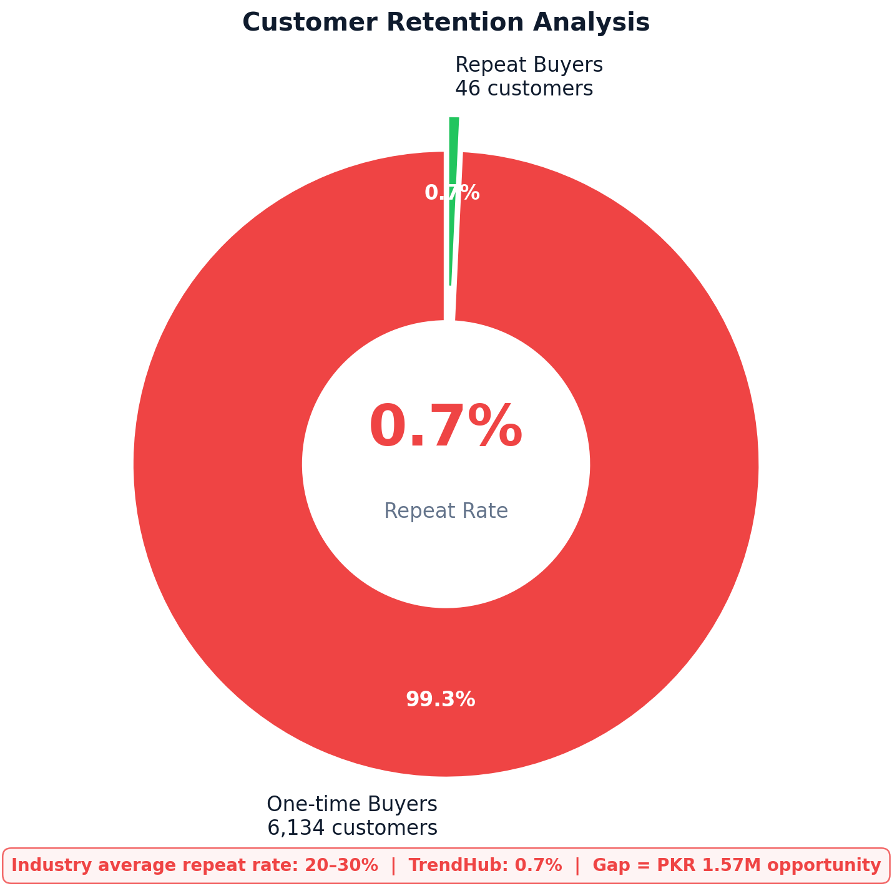

# Shopify Analytics Case Study — TrendHub.com.pk

## Overview
A full e-commerce analytics audit for a Pakistan-based Shopify store generating 
PKR 21.9 million in annual revenue across 8,513 paid orders and 15+ cities nationwide.

The analysis covers 12 months of order data (June 2025 – June 2026) examining 
revenue trends, customer retention, product performance, and geographic distribution.

---

## Key Findings

| Metric | Value |
|---|---|
| Total Revenue (12 months) | PKR 21.9M |
| Paid Orders | 8,513 |
| Average Order Value | PKR 2,571 |
| Repeat Purchase Rate | 0.7% (industry avg: 20–30%) |
| Recoverable Revenue (win-back) | PKR 1.57M |
| Void Rate (all orders) | 48% |
| Cities Reached | 15+ |

---

## Insights

- **Retention Crisis** — 99.3% of customers never returned for a second order, 
representing PKR 1.57M in untapped revenue from lapsed customers alone
- **Product Concentration Risk** — A single product (3-in-1 Handheld Vacuum Cleaner) 
accounted for 18.4% of total revenue
- **Geographic Opportunity** — Mid-tier cities (Sialkot, Gujranwala, Multan) showing 
organic traction with minimal ad spend
- **Revenue Decline** — 70% growth peak in January 2026 followed by a 20% decline 
requiring investigation
- **Void Rate** — 48% of all resolved orders never completed, driven by COD 
cancellations and courier returns

---

## Visualisations

### Monthly Revenue Trend

### Top 10 Products by Revenue

### Top 10 Cities by Order Count

### Customer Retention Analysis

---

## Tools Used

| Tool | Purpose |
|---|---|
| Python | Core analysis language |
| Pandas | Data cleaning and manipulation |
| Matplotlib | Data visualisation |
| Google Colab | Development environment |
| ReportLab | PDF report generation |

---

## Repository Structure

├── README.md
├── sample_data_anonymised.csv    # Anonymised sample of 500 orders
├── chart1_monthly_revenue.png    # Monthly revenue trend
├── chart2_products.png           # Top 10 products by revenue
├── chart3_cities.png             # Top 10 cities by order count
└── chart4_retention.png          # Customer retention analysis

---

## About

This project was completed as part of a freelance data analytics engagement. 
All customer data has been anonymised. Real store data is not included in this repository.

**Analyst:** Izaan Kazmi
**Contact:** izaankazmi541@gmail.com
**LinkedIn:** [linkedin.com/in/imk1998](https://www.linkedin.com/in/imk1998/)
